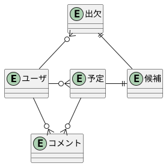

# 用語
| item         | desc                                   |
| ------------ | -------------------------------------- |
| user         | サービス利用者                         |
| schedule     | 予定・複数ユーザの出欠が必要なイベント |
| candidate    | 候補日                                 |
| availability | 出欠・「欠席・わからない・出席」       |
| comment      | コメント                               |

# データモデリング



# UML設計
## ページ一覧
- トップ/自分が作った予定の一覧表示ページ
- 予定表示/出欠表/コメントページ
- 予定作成ページ
- 予定編集ページ

#　ページのURL一覧

| path                       | method | content                                 |
| -------------------------- | ------ | --------------------------------------- |
| /                          | get    | トップ/自分が作った予定の一覧表示ページ |
| schedules/new              | get    | 予定作成ページ                          |
| schedules/:scheduleId      | get    | 予定表示・出欠表・コメントページ        |
| schedules/:scheduleId/edit | get    | 予定編集ページ                          |
| login                      | get    | ログイン                                |
| logout                     | get    | ログアウト                              |

# API一覧
| URI                                                          | method |
| ------------------------------------------------------------ | ------ |
| /schedules                                                   | post   |
| /schedules/:scheduleId?edit=1                                | post   |
| /schedules/:scheduleId?delete=1                              | post   |
| /schedules/:scheduleId/users/:userId/candidates/:candidateId | post   |
| /schedules/:scheduleId/users/:userId/comments                | post   |

# モジュール設計
## Routerモジュール一覧

```
└── routes
    ├── availablilities.js     出欠の更新に関する処理
    ├── comments.js            コメント更新に関する処理
    ├── login.js               ログイン処理
    ├── logout.js              ログアウト処理
    └── schedules.js           予定に関する処理
```

## データモデル一覧

```
├── models
│   ├── availability.js        出欠の定義と永続化
│   ├── candidate.js           候補の定義と永続化
│   ├── comment.js             コメントの定義と永続化
│   ├── schedule.js            予定の定義と永続化
│   └── user.js                ユーザーの定義と永続化
```

# 予定（schedule）のデータモデリング

| schheduleの属性 | 形式   | 内容                                |
| --------------- | ------ | ----------------------------------- |
| scheduleId      | UUID   | 予定,ID,PrimaryKey,連番で付与される |
| scheduleName    | 文字列 | 予定名                              |
| memo            | 文字列 | めも                                |
| createdBy       | 数値   | 作成者、ユーザID                    |
| updatedAt       | 日付   | 更新日時                            |

- UUID : Universally Unique Identifier
  - 全世界で同じ値を持つことがない一意な識別子 uuidp

# 候補日（candidate）のデータモデリング
| condidateの属性 | 形式   | 内容                   |
| --------------- | ------ | ---------------------- |
| candidate       | 数値   | 候補日程ID,主キー,連番 |
| candidateName   | 文字列 | 候補日名               |
| schheduleId     | UUID   | 関連する予定ID         |


# 出欠（availability）のデータモデリング

| 属性名       | 形式 | 内容                    |
| ------------ | ---- | ----------------------- |
| candidateId  | 数値 | 候補日程uID,主キー      |
| userId       | 数値 | GitHubのユーザID,主キー |
| availability | 数値 | 出欠の種類              |
| scheduleId   | UUID | 関連する予定ID          |

# コメントのデータモデリング

| 属性名     | 形式   | 内容                    |
| ---------- | ------ | ----------------------- |
| scheduleId | UUID   | 関連する予定ID, 主キー  |
| userId     | 数値   | GitHubのユーザID,主キー |
| comment    | 文字列 | コメント                |
